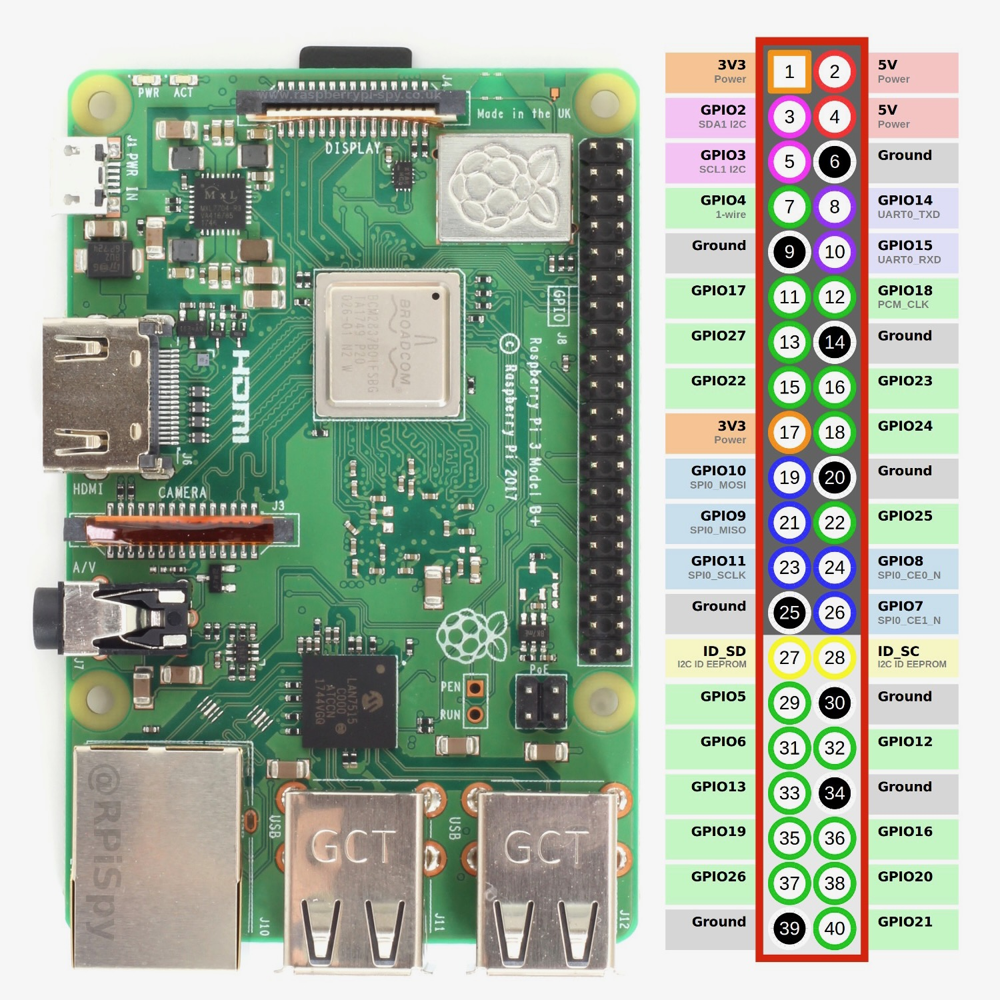

# Raspberry Pi

Table of Contents
=================

* [Setup](#setup)
* [Configuration](#configuration)
* [Remote GUI access](#remote-gui-access)
* [Copy files](#copy-files)
* [Find info about your Pi](#find-info-about-your-pi)
* [Learn about electronics](#learn-about-electronics)
   * [GPIO Header](#gpio-header)


## Setup

1. Write and preconfigure Raspberry Pi OS on the SD card using Raspberry Pi Imager (```brew install --cask raspberry-pi-imager```). Make sure you use the correct version of the OS (32-bit or 64-bit).
   - Change the default password for the ```pi``` user.
   - Enable SSH (password or ssh keys).
   - Configure WiFi if needed.
   - Take note of the hostname.
2. Insert the SD card in your Raspberry Pi and turn it on. 

## Configuration

Find the IP of your Raspberry Pi using its hostname or find all devices on your network with `arp -a`.
```Shell
arp raspberrypi4.local 
```
SSH into it with the ```pi``` user.
```Shell
ssh pi@192.168.xxx.xxx
# You'll be asked for the password if applicable
```

Configure it.
```Shell
pi@raspberrypi4:~ $ sudo raspi-config
# Go to Interface Options, VNC (for graphical remote access)
# Tab to the Finish option and reboot.
```
Update it.  
```upgrade``` is used to install available upgrades of all packages currently installed on the system. New packages will be installed if required to satisfy dependencies, but existing packages will never be removed. If an upgrade for a package requires the removal of an installed package the upgrade for this package isn't performed.  
```full-upgrade``` performs the function of upgrade but will remove currently installed packages if this is needed to upgrade the system as a whole.
```Shell
pi@raspberrypi4:~ $ sudo apt update # updates the package list
pi@raspberrypi4:~ $ sudo apt full-upgrade
```

## Remote GUI access

Now you'll need a VNC viewer on your laptop to connect to the Raspberry Pi using the graphical interface.
```Shell
brew install --cask vnc-viewer
```

Apparently, on Raspberry Pi pip does not download from the python package index (PyPi), it downloads from PiWheels. PiWheels wheels do not come with pygame's dependencies that are bundled in normal releases.

Install Pygame [dependencies](https://www.piwheels.org/project/pygame/) and Pygame.
```Shell
pi@raspberrypi4:~ $ sudo apt install libvorbisenc2 libwayland-server0 libxi6 libfluidsynth2 libgbm1 libxkbcommon0 libopus0 libwayland-cursor0 libsndfile1 libwayland-client0 libportmidi0 libvorbis0a libopusfile0 libmpg123-0 libflac8 libxcursor1 libxinerama1 libasyncns0 libxrandr2 libdrm2 libpulse0 libxfixes3 libvorbisfile3 libmodplug1 libxrender1 libsdl2-2.0-0 libxxf86vm1 libwayland-egl1 libsdl2-ttf-2.0-0 libsdl2-image-2.0-0 libjack0 libsdl2-mixer-2.0-0 libinstpatch-1.0-2 libxss1 libogg0
pi@raspberrypi4:~ $ sudo pip3 install pygame
```

Check that the installation worked by running one of its demos
```Shell
pi@raspberrypi4:~ $ python3 -m pygame.examples.aliens
```

## Copy files

Copy files between Pi and local machine. On local machine run:
```Shell
scp -r pi@raspberrypi2.local:/home/pi/Documents/ ~/Documents/pidocs
```

## Find info about your Pi

32 or 64-bit kernel?
```Shell
getconf LONG_BIT
# or check machine's hardware name: armv7l is 32-bit and aarch64 is 64-bit
pi@raspberrypi4:~ $ uname -m
```

See OS version
```Shell
cat /etc/os-release
```

Architecture    
If the following returns a ```Tag_ABI_VFP_args``` tag of ```VFP registers```, it's an ```armhf``` (```arm```) system.  
A blank output means ```armel``` (```arm/v6```).
```Shell
pi@raspberrypi2:~ $ readelf -A /proc/self/exe | grep Tag_ABI_VFP_args
```
Or check the architecture with:
```Shell
hostnamectl
```

## Learn about electronics

I've added some sample code from the [MagPi Essentials book](https://magpi.raspberrypi.com/books/essentials-gpio-zero-v1).  
[Sample code](../raspberrypi/)

### GPIO Header

